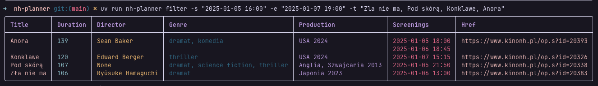

# nh-planner (in progress)

A CLI app that enables to scrape the screenings of Nowe Horyzonty cinema ([NH](https://www.kinonh.pl/index.s)) and then to filter the data.




## About

```
├── nh_planner
│   ├── __init__.py
│   ├── cli
│   │   ├── __init__.py
│   │   ├── app.py
│   │   └── commands
│   │       ├── filter.py
│   │       ├── get_limited.py
│   │       ├── info.py
│   │       ├── recommend.py
│   │       ├── refresh.py
│   │       └── utils.py
│   ├── core
│   │   ├── config.py
│   │   └── models.py
│   ├── main.py
│   └── services
│       ├── database.py
│       ├── embeddings.py
│       ├── filters.py
│       └── scraper.py
├── pyproject.toml
└── uv.lock
```

## Installation

